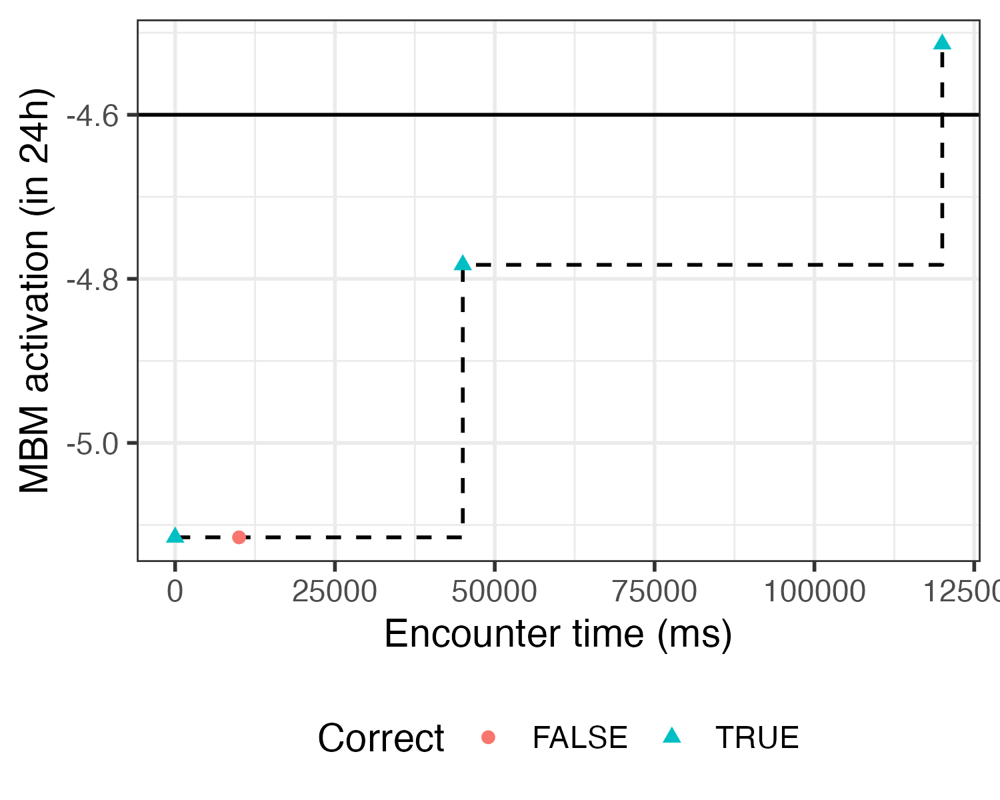

# Model-Based Mastery

A method for determining the mastery state of each individual fact using a computational cognitive model.



## Notebooks

- [Demo of the Model-Based Mastery calculation](output/model_based_mastery.md)

## Usage

Run the demo:
```bash
make demo
```

## Funding

This project is co-financed by the National Education Lab AI.

<a href="https://www.ru.nl/nolai"></a>