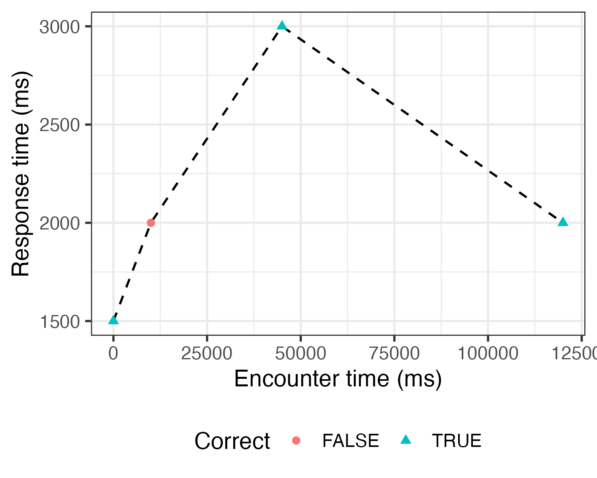
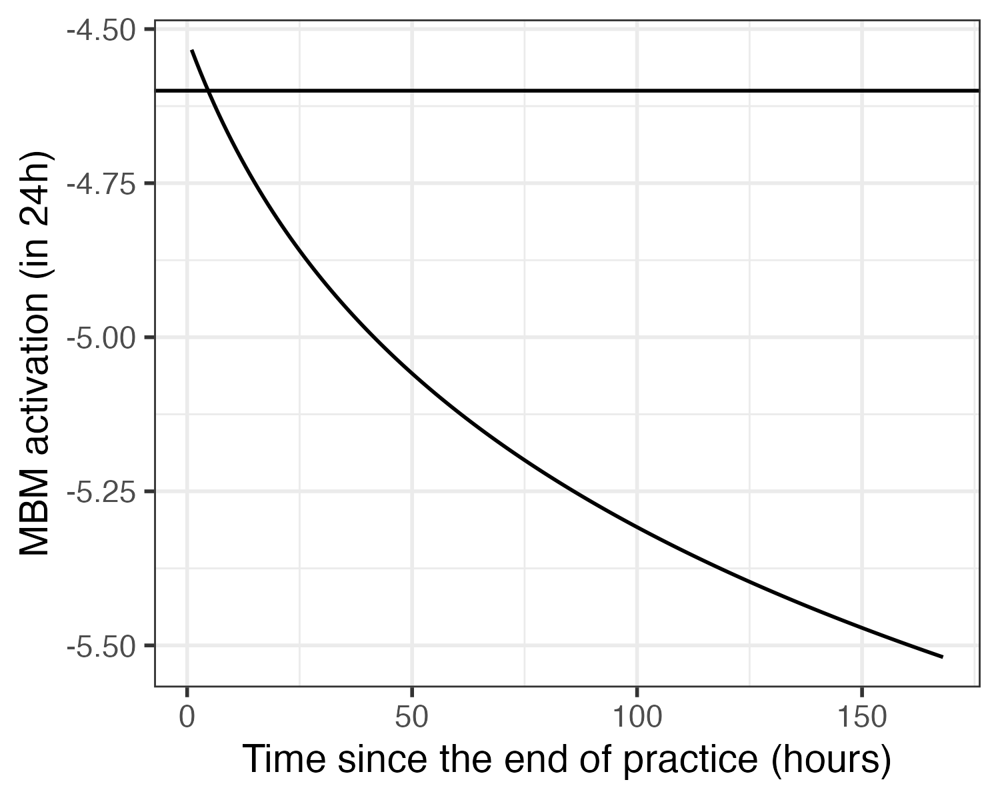

# Overview

This notebook demonstrates how to calculate Model-Based Mastery (MBM) activation from a learner's responses to a single item over time.
This is a long-term prediction of memory activation of the item, based on the learner's responses during a retrieval practice session.

We use the following equation (from [Iancu et al., 2024](https://escholarship.org/uc/item/8rm2x2gn)) to model mastery activation $A$ at a time point $t$, given correct responses at times $t_1, \dots, t_n$ and an activation-dependent decay rate $d_i$ ([Pavlik & Anderson, 2005](https://doi.org/10.1207/s15516709cog000014)).
For instance, to evaluate mastery activation 24 hours after the last response, we set time $t + 24h$.
$$
A(t + 24h) = \ln \sum_{i=1}^{n} ((t + 24h) - t_i)^{-d_i}
$$
where $d_i = 0.25 e^{A(t_i)} + .45$.

This function returns a continuous value in the range $(-\infty, \infty)$, where higher values indicate stronger mastery of the item.
The activation may be converted into a probability of recall using a logistic function, or simply compared to a threshold value $\tau_M$ to determine whether the item has reached a sufficient activation level to be considered mastered:

$$
M(f, t) = \begin{cases}
1 & \text{if } A(t) \geq \tau_M \\
0 & \text{otherwise}
\end{cases}
$$

The threshold $\tau_M$ may be estimated from recall data (e.g., see [van der Velde et al., 2026](https://doi.org/10.1038/s41539-026-00447-1)) and adjusted to the desired level of mastery for a given context.


```{r setup}
library(here)
library(ggplot2)

theme_set(theme_bw(base_size = 14))

source(here("scripts", "mbm_funs.R"))
```

# Example data

We can see how the calculation works using example data: a learner responding to the same item presented at four different times in a retrieval practice session.
The first presentation is a study trial (both the cue and answer are shown), all subsequent presentations are test trials (only cue is shown) on which the learner has to provide an answer.
The accuracy and response time of the answer are recorded.

```{r generate-example-data}
responses <- data.table(
  start_time = c(0, 10000, 45000, 120000),    # presentation start time (ms)
  study_trial = c(TRUE, FALSE, FALSE, FALSE), # is this a study trial? (logical)
  correct = c(TRUE, FALSE, TRUE, TRUE),       # is response correct? (logical)
  rt = c(1500, 2000, 3000, 2000)              # reaction time (ms)
)

responses

p_example <- ggplot(responses, aes(x = start_time, y = rt)) +
  geom_line(linetype = "dashed") +
  geom_point(aes(pch = correct, colour = correct)) +
  labs(x = "Encounter time (ms)", y = "Response time (ms)", colour = "Correct", pch = "Correct") +
  theme(legend.position = "bottom")

ggsave(plot = p_example, here("output", "example_responses.png"), width = 5, height = 4)
```



# Calculate mastery activation

We can calculate Model-Based Mastery activation at different time points after the last response, using the `calculate_mbm_activation()` function.
The resulting value gives us the expected memory activation at that point in time.
This value can be used to determine whether an item has had sufficient study to exceed a mastery threshold and can therefore be considered 'mastered'.

## 24 hours after practice

By default, the function calculates the expected activation 24 hours after the last response:
```{r, calculate-24h-mbm}
mbm_24h <- calculate_mbm_activation(responses)
message("MBM activation 24h after practice: ", round(mbm_24h, 3))
```

## After each response

To see how the mastery activation changes after each response, we can calculate the expected activation 24 hours after each response, as it happens.
This shows how the mastery activation is affected by the accuracy of each response: an incorrect response does not increase the activation, while a correct response does.
For this example, we (arbitrarily) assume that exceeding a mastery threshold of -4.6 means that the item has been learned sufficiently well.
Here, this is achieved after the fourth response.
```{r calculate-response-mbm}
responses[, mbm_activation := map_dbl(1:nrow(responses), ~calculate_mbm_activation(responses[1:.x]))]

mastery_threshold <- -4.6

p_mbm_by_response <- ggplot(responses, aes(x = start_time, y = mbm_activation)) +
  geom_hline(aes(yintercept = mastery_threshold)) +
  geom_step(linetype = "dashed") +
  geom_point(aes(pch = correct, colour = correct)) +
  labs(x = "Encounter time (ms)", y = "MBM activation (in 24h)", colour = "Correct", pch = "Correct") +
  theme(legend.position = "bottom")

ggsave(plot = p_mbm_by_response, here("output", "mbm_activation_by_response.png"), width = 5, height = 4)
```


## 24+3 hours after practice

Once practice stops, mastery activation will decay over time.
For example, 3 hours after the last response, the projected activation 24 hours later will have dropped slightly, given the extra time that has passed.
The longer we wait after practice, the lower the projected activation will be, and the stronger the need for further practice becomes if we want to maintain mastery.
```{r calculate-24h+3h-mbm}
mbm_24_3h <- calculate_mbm_activation(responses, mastery_lookahead_time = h_to_ms(24 + 3))
message("MBM activation 24+3h after practice: ", round(mbm_24_3h, 3))
```

## Week after practice

On longer timescales, the decay of mastery activation is more pronounced.
The plot below shows projected mastery activation in 24 hours at various time points in the week following practice.
```{r calculate-week-mbm}
ts <- seq(1, 7*24, 1)
act <- data.table(
  t = ts,
  mbm_act = map_dbl(ts, ~calculate_mbm_activation(responses, mastery_lookahead_time = h_to_ms(24 + .x)))
)

p_week_mbm <- ggplot(act, aes(x = t, y = mbm_act)) +
  geom_hline(aes(yintercept = mastery_threshold)) +
  geom_line() +
  labs(x = "Time since the end of practice (hours)", y = "MBM activation (in 24h)")

ggsave(plot = p_week_mbm, here("output", "mbm_activation_week.png"), width = 5, height = 4)
```

